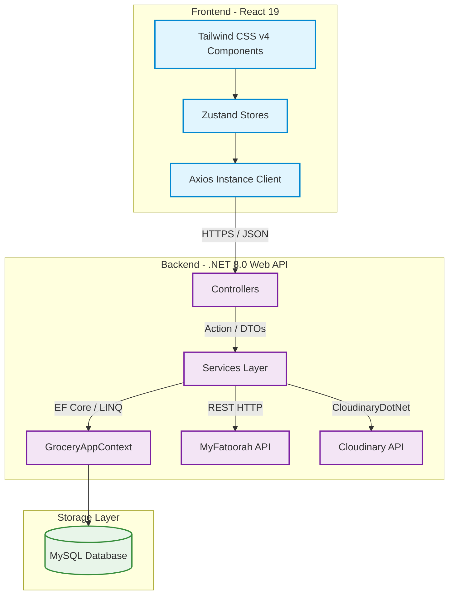

# 🍃 GreenCart E-Commerce Platform

🌐 **Live Application**: [https://greencart-civd.onrender.com/](https://greencart-civd.onrender.com/)

**GreenCart** (also known as **FreshDrop**) is a modern, high-performance, and feature-rich e-commerce application tailored for grocery shopping and delivery. Built with a robust, enterprise-ready **.NET 8.0 Web API** backend and a high-performance **React 19 + Vite** frontend styled with **Tailwind CSS v4.0**, it features seamless shopping, persistent state management, Cloudinary-based media uploads, and integrated **MyFatoorah** payment gateway processing.

---

## Table of Contents
1. [Key Features](#key-features)
2. [Tech Stack](#tech-stack)
3. [Architecture Overview](#architecture-overview)
4. [Project Structure](#project-structure)
5. [Getting Started](#getting-started)
   - [Prerequisites](#prerequisites)
   - [Backend Configuration](#backend-configuration)
   - [Frontend Configuration](#frontend-configuration)
6. [API Endpoint Directory](#api-endpoint-directory)
7. [License](#license)

---

## Key Features

### 🛒 Customer Experience
- **Interactive Product Catalog**: Search, browse, and filter products by categories with custom search and real-time listings.
- **Persistent Shopping Cart**: A fluid shopping cart powered by Zustand state management and synchronized with the backend database.
- **Secure Address Book**: Manage multiple shipping/billing addresses dynamically.
- **Dual Checkout System**: Supports Cash on Delivery (COD) and Online Payments (via MyFatoorah API integration).
- **Personalized Order History**: Keep track of pending, completed, or failed orders, with real-time status details.

### 💼 Seller & Admin Dashboard
- **Admin Authentication**: Safe role-based protection ensuring only verified sellers access management views.
- **Inventory Control**: Add new products, edit pricing/descriptions, delete products, and manage stock levels.
- **Dynamic Media Upload**: Direct integration with **Cloudinary API** for fast and optimized product image hosting.
- **Order Fulfilment Panel**: Live feed of customer orders with options to review details and track fulfilment status.

---

## Tech Stack

| Layer | Technology | Key Features / Packages |
| :--- | :--- | :--- |
| **Frontend** | React 19.0 (JavaScript ES6) | Vite 6, Zustand 5 (State Management), React Router 7 (Navigation), Axios (API client), Tailwind CSS v4, Lucide React (Icons), React Hot Toast |
| **Backend** | .NET 8.0 Web API | Entity Framework Core 8, Pomelo MySQL, JWT Bearer Auth, HttpClient Factory, Swashbuckle (Swagger UI) |
| **Database** | MySQL Server | Relational schema, indexes for optimization, EF Core migrations |
| **Third-Party** | Cloudinary & MyFatoorah | CloudinaryDotNet SDK (Images), MyFatoorah REST API (Payments) |

---

## Architecture Overview



---

## Project Structure

```
E-Commerce Application/
├── backend/                  # .NET 8.0 ASP.NET Core Project
│   ├── Controllers/          # REST Controllers (Auth, Product, Cart, Order, Address)
│   ├── Data/                 # DB Context & Entity Framework Migrations
│   ├── Entities/             # Database Entities / Models (User, Product, Cart, Order)
│   ├── Models/               # Request/Response DTOs & Custom Models
│   ├── Services/             # Business Logic Layer (Auth, Product, Cart, Address, Order)
│   ├── appsettings.json      # Backend Configurations (DB, Cloudinary, JWT, MyFatoorah)
│   └── Program.cs            # Application Bootstrap & Dependency Injection (DI)
│
├── frontend/                 # React 19 + Vite App
│   ├── src/
│   │   ├── components/       # Reusable UI Elements (Navbar, Footer, Product Cards)
│   │   ├── pages/            # View Pages (Home, Cart, Product Details, Orders)
│   │   │   └── seller/       # Seller-specific admin pages
│   │   ├── store/            # Zustand Stores (Auth, Cart, Product, Order, Address)
│   │   ├── lib/              # Axios instance with Interceptors
│   │   └── App.jsx           # App shell & router configurations
│   ├── package.json          # Node dependencies & run scripts
│   └── tailwind.config.js    # Tailwind configuration / CSS assets
```

---

## Getting Started

### Prerequisites
Make sure you have the following installed on your local environment:
- [.NET 8.0 SDK](https://dotnet.microsoft.com/download/dotnet/8.0)
- [Node.js](https://nodejs.org/) (v18.x or later)
- [MySQL Server](https://dev.mysql.com/downloads/installer/) (v8.x)

---

### Backend Configuration

1. **Database Setup**: Ensure your MySQL server is running.
2. **Configuration (`backend/appsettings.json`)**: Open [backend/appsettings.json](./backend/appsettings.json) and configure your connection credentials, JWT settings, Cloudinary credentials, and MyFatoorah payment api details:
   ```json
   {
     "AppSettings": {
       "Token": "your_secure_jwt_token_secret_key_here",
       "Issuer": "MyGroceryStore",
       "Audience": "MyGroceryStoreAudience"
     },
     "ConnectionStrings": {
       "DefaultConnection": "server=localhost;port=3306;database=GroceryAppDb;user=root;password=YOUR_PASSWORD"
     },
     "Cloudinary": {
       "CloudName": "YOUR_CLOUDINARY_NAME",
       "ApiKey": "YOUR_CLOUDINARY_API_KEY",
       "ApiSecret": "YOUR_CLOUDINARY_API_SECRET"
     },
     "MyFatoorah": {
       "ApiUrl": "https://apitest.myfatoorah.com/",
       "ApiKey": "YOUR_MYFATOORAH_API_KEY"
     }
   }
   ```
3. **Database Migrations**: Execute database migrations inside the `/backend` directory to construct the MySQL schema:
   ```bash
   cd backend
   dotnet ef database update
   ```
4. **Run the Backend**:
   ```bash
   dotnet run
   ```
   The backend API will start by default at `http://localhost:5233` (HTTP) or standard configured port. You can browse the interactive API documentation at:
   `http://localhost:5233/swagger`

---

### Frontend Configuration

1. **Dependency Installation**: Navigate to the `/frontend` directory and install project dependencies:
   ```bash
   cd frontend
   npm install
   ```
2. **Environment Variable Configuration**: Note that the backend URL defaults to `http://localhost:5233/api` inside [frontend/src/lib/axios.js](./frontend/src/lib/axios.js). If you run the backend on a different port, update the `baseURL` inside `axios.js`.
3. **Start Development Server**:
   ```bash
   npm run dev
   ```
   Open your browser to `http://localhost:5173` to interact with the application.

---

## API Endpoint Directory

Below is an overview of the core endpoints exposed by the ASP.NET Core backend:

| Controller | HTTP Method | Endpoint Path | Authentication | Description |
| :--- | :--- | :--- | :--- | :--- |
| **Auth** | `POST` | `/api/Auth/register` | None | Register a new customer or seller |
| | `POST` | `/api/Auth/login` | None | Authenticate and retrieve JWT token |
| | `GET` | `/api/Auth/me` | JWT Required | Check auth state and retrieve current user |
| **Products** | `GET` | `/api/Products` | None | Retrieve list of all active products |
| | `GET` | `/api/Products/{id}` | None | Fetch single product details |
| | `POST` | `/api/Products` | JWT + Admin | Add a new product (with Cloudinary image) |
| | `PUT` | `/api/Products/{id}` | JWT + Admin | Update product details |
| | `DELETE` | `/api/Products/{id}` | JWT + Admin | Remove product from inventory |
| **Cart** | `POST` | `/api/Cart/add` | JWT Required | Add an item to the shopping cart |
| | `GET` | `/api/Cart/user` | JWT Required | Fetch all cart items for current user |
| | `DELETE` | `/api/Cart/remove` | JWT Required | Remove item or decrease quantity |
| **Address** | `POST` | `/api/Address` | JWT Required | Add new delivery address |
| | `GET` | `/api/Address/user` | JWT Required | Get all registered addresses of a user |
| **Order** | `POST` | `/api/Order/cod` | JWT Required | Place order using Cash on Delivery (COD) |
| | `POST` | `/api/Order/myfatoorah` | JWT Required | Place order and get MyFatoorah payment URL |
| | `GET` | `/api/Order/verify-payment`| JWT Required | Verify MyFatoorah payment state |
| | `GET` | `/api/Order/user` | JWT Required | Get order history of a specific user |
| | `GET` | `/api/Order/all` | JWT + Admin | Get all placed orders for fulfilment |

---

## License
This project is licensed under the [MIT License](LICENSE).
